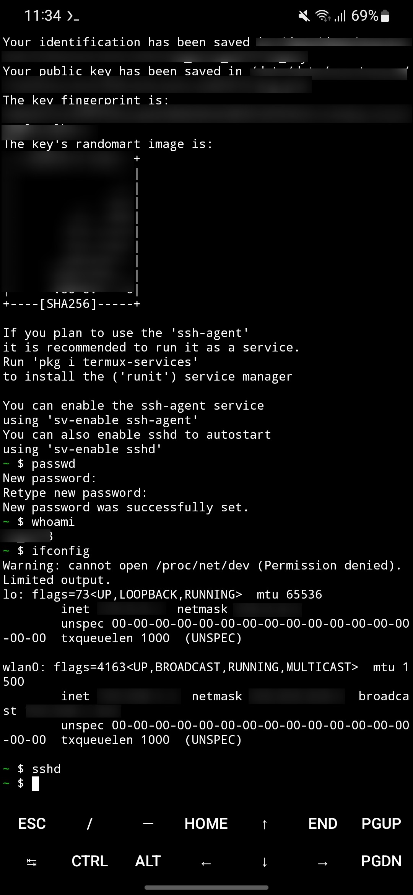
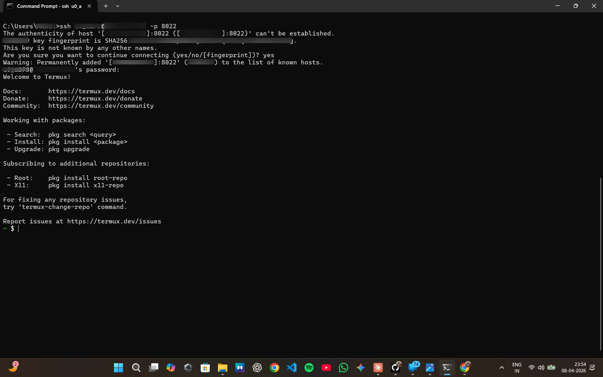
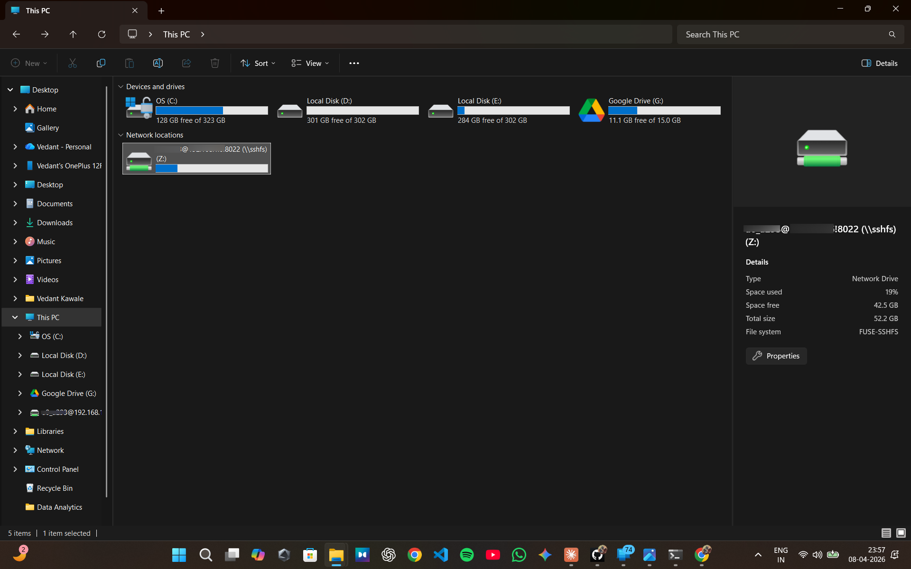

## **🌐 ZeroCloud: Your Personal Mobile NAS**

🚀 **Transform your Android smartphone into a powerful Network Attached Storage (NAS) device!**

ZeroCloud bridges the gap between your mobile world and your desktop experience. By setting up a secure server on your phone, it allows you to mount your entire Android file system as a local, accessible drive (e.g., `Z:`) directly within **Windows File Explorer**. No cables, no third-party cloud apps—just your data, accessible over your local Wi-Fi. 🏠💨

<nobr></nobr>
|
<nobr></nobr>
|
<nobr></nobr>
|

|
\

&nbsp;&nbsp;&nbsp;&nbsp;&nbsp;&nbsp;&nbsp;&nbsp;&nbsp;&nbsp;&nbsp;&nbsp;

&nbsp;&nbsp;&nbsp;&nbsp;&nbsp;&nbsp;&nbsp;&nbsp;&nbsp;&nbsp;&nbsp;&nbsp;
 

---

### **🌟 Core Functionality**

* **⚡ Wireless File Management:** Drag, drop, open, edit, and delete files on your phone directly from your PC as if they were on a local hard drive.
* **🔒 Secure by Design:** All data transfers between your phone and PC are encrypted using industry-standard SSH, keeping your private data safe on your local network.
* **🛠️ Cable-Free Freedom:** Access your photos, videos, and documents without searching for a USB cable.
* **💻 Seamless Integration:** Integrates perfectly with Windows File Explorer; no proprietary dashboards or complex interfaces are required for daily use.

---

### **🛠️ The Technology Stack**

This project leverages a powerful combination of open-source tools to create a seamless cross-platform experience.

#### **📱 On Your Android Device (The Server)**

* **📟 Termux:** A robust terminal emulator and Linux environment for Android. It provides the sandbox necessary to run network servers without needing to root your device.
* **🔑 OpenSSH:** The Gold Standard for secure remote access. It implements the **SSH protocol** for encryption and authentication, and provides the **SFTP server** subsystem that Windows connects to.
* **📡 Port 8022:** To operate safely without root permissions, the SSH server runs on this non-standard port, ensuring it doesn't conflict with system services.

#### **💻 On Your Windows PC (The Client)**

* **🔌 SSHFS-Win (SSH File System for Windows):** A critical component that allows Windows to "understand" how to mount remote SFTP directories as local drive letters.
* **🏗️ WinFsp (Windows File System Proxy):** The foundational driver that SSHFS-Win uses to manage virtual file systems. It acts as the bridge between the network protocol and the Windows kernel.

---

### **🏗️ How It Works (High-Level)**

1.  **Phone:** Termux hosts an **OpenSSH/SFTP server** 🔑.
2.  **Network:** Both devices connect to the same **local Wi-Fi** 🏠.
3.  **PC:** SSHFS-Win (powered by WinFsp) connects to the phone's IP on **port 8022** 📡.
4.  **Result:** Your Windows PC "sees" the phone's storage as a new **network drive** 💻!
